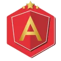

# Olá, eu sou Gabriel Rosa 👋

Desenvolvo há 5 anos soluções full-stack, com foco em conversão, SEO e vendas, impactando mais de 50 mil usuários.

Além de aumentar a performance de sistemas em até 30%, sou especializado em reduzir custos ao criar arquiteturas de sistemas eficientes. Também trabalho com integração de webhooks para automatizar processos e garantir maior agilidade. Reduzo o tempo de desenvolvimento em até 40% e sempre busco estratégias ágeis que geram resultados concretos, com foco em conversão e crescimento.

## :telephone_receiver: Contato

[%2091356--4300-%237289DA?logo=whatsapp)](https://wa.me/+5511913564300)

### Idiomas - Languages

    Português - Nativo

 

    English - Intermediary

## Decola Tech 2025 - Avanade

Recentemente, tive o privilégio de concluir o desafio Decola Tech 2025 da DIO, em parceria com a Avanade. Durante o programa, desenvolvi 8 projetos utilizando Java com Spring Boot, Angular e Inteligência Artificial, com foco na certificação AI-900 da Microsoft.

Como parte do meu processo de aprendizado, criei uma organização para separar todos os projetos, facilitando a visualização. Você pode conferir os projetos [AQUI](https://github.com/Avanade-Bootcamp).

    
    
    
    
    
    
    
    
    
    
    

## 🚀 Tecnologias que uso

- **Frontend**: React, React Native, Next.js, Angular, Tailwind CSS, TypeScript
- **Backend**: Node.js, Java, SpringBoot, AWS (Lambda, DynamoDB, Amplify), SQL Server
- **Ferramentas e Serviços**: Docker, JWT, GitHub Actions, AWS Amplify, Serverless Framework, Servidores VPS